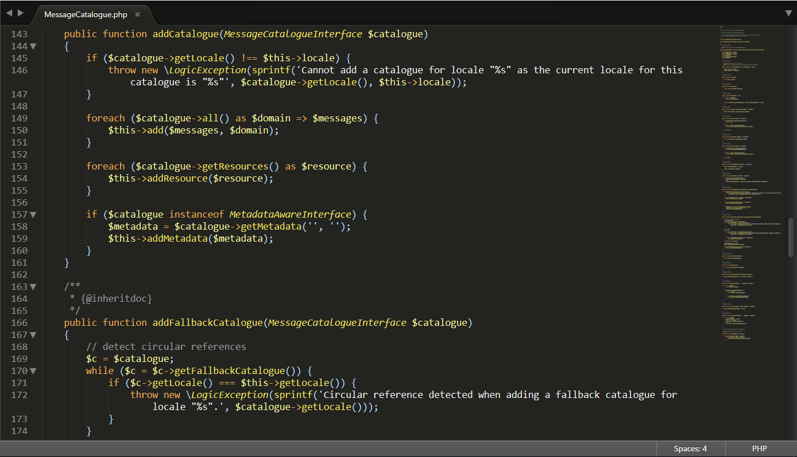
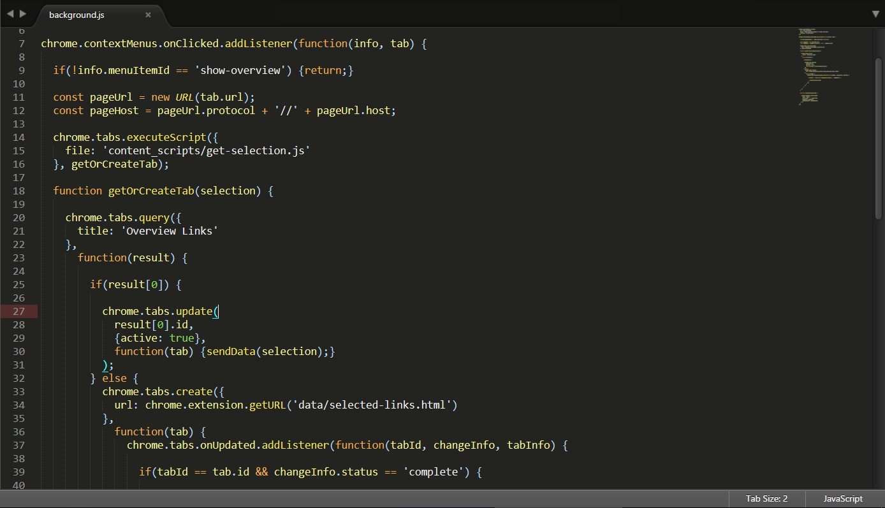
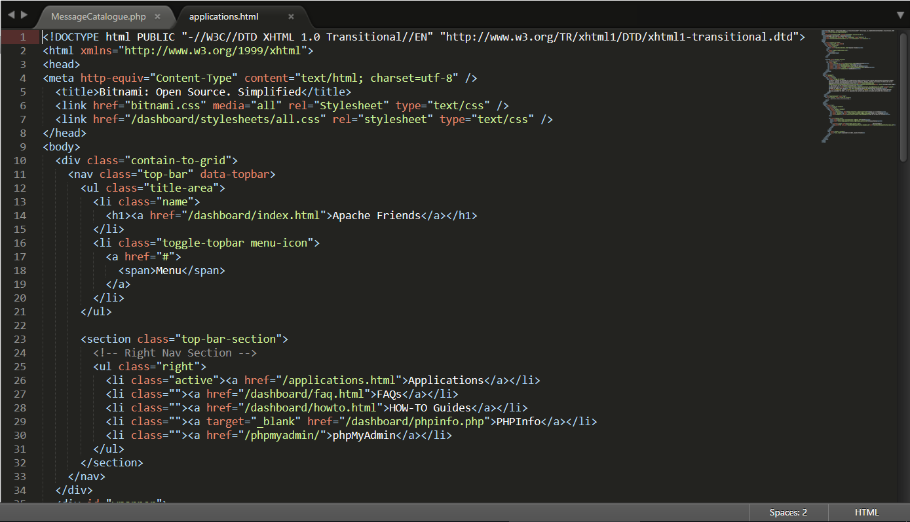

# Yellowhammer

A Sublime Text 3 color scheme.

## Screenshots

#### PHP



#### Javascript



#### HTML



## Installation

Installation is simply a matter of getting the `Yellowhammer.tmTheme` file from this repository into your `Packages` directory (which you can find by choosing `Preferences > Browse Packages...` from the top menu within Sublime Text 3).

To do this, you can choose any of the following options:

#### Using git

While inside your `Packages` directory, clone the repository using the following command:
```
git clone https://github.com/mvune/yellowhammer.git
```

#### Manually

* Download the repository [ZIP](https://github.com/mvune/yellowhammer/archive/master.zip)
* Unzip the files
* Copy the unzipped folder (or just the `Yellowhammer.tmTheme` file) to your `Packages` directory

## Activate

After installation you can activate the theme. Either go to `Preferences > Settings` and update the `"color_scheme"` setting to the following:
```
{
    "color_scheme": "Packages/Yellowhammer.tmTheme"
}
```
...or simply go to `Preferences > Color Scheme` and choose `Yellowhammer`.
